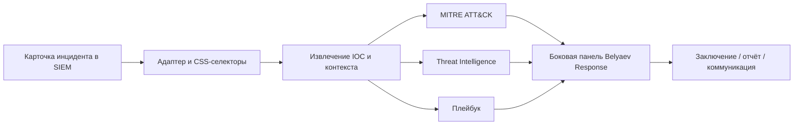

<div align="center">

# 🛡️ Belyaev Response

### AI second brain для SOC-аналитика

*Браузерное расширение, которое помогает быстрее и качественнее расследовать инциденты — прямо в интерфейсе SIEM.*

[](#)
[](#)
[](#)
[](#)

**IOC · MITRE ATT&CK · Playbooks · AI-наставник · DFIR · Incident Reporting**

</div>

# 🛡️ Belyaev Response — контрольные суммы релиза `v1.6.0`

> Проверяйте контрольные суммы после скачивания дистрибутива, чтобы убедиться в целостности и подлинности файла.

| Параметр | Значение |
|---|---|
| **Версия** | `v1.6.0` |
| **Дата сборки** | `15 августа 2026` |
| **Компонент** | Браузерное расширение для SOC-аналитиков |
| **Архив** | `belyaev-response-v1.6.0.rar` |
| **Размер** | `148 KB` |

---

## 🔐 Контрольные суммы

| Алгоритм | Контрольная сумма |
|---|---|
| **SHA-1** | `949c5cda7516e3fc477a3eee63904a0fc0a72d0a` |
| **SHA-256** | `7cea4dbd6fed4edf6507888c66426a0e54d44c9e380686a4cfbee6110e974bae` |
| **SHA-512** | `5943400ea6beea91af942bb93f7e52fee56c61886856baa039229605ba29498596aed7bb52ce0d9f92419e308ff9410f3a27bf9470acfd1f7fddbd7ff54c818e` |

---

## ✅ Проверка целостности

### Linux / macOS

```bash
sha256sum belyaev-response-v1.6.0.rar
```

Сравните полученное значение с опубликированной контрольной суммой **SHA-256**:

```text
7cea4dbd6fed4edf6507888c66426a0e54d44c9e380686a4cfbee6110e974bae
```

### Windows PowerShell

```powershell
Get-FileHash .\belyaev-response-v1.6.0.rar -Algorithm SHA256
```

Ожидаемый результат:

```text
SHA256  7CEA4DBD6FED4EDF6507888C66426A0E54D44C9E380686A4CFBEE6110E974BAE
```

> ⚠️ Если рассчитанная сумма отличается хотя бы одним символом, **не устанавливайте и не используйте файл**. Скачайте архив повторно из официального источника.
---

## 🎯 Что это

**Belyaev Response** — MVP-расширение для Яндекс Браузер, Chrome и Edge, которое открывается поверх карточки инцидента в SIEM и превращает рабочее место аналитика в единый центр расследования.

Оно извлекает IOC, сопоставляет события с MITRE ATT&CK, подбирает плейбук, помогает обогатить индикаторы через Threat Intelligence, формирует черновик заключения и развивает аналитика через контекстный AI-наставник.

> Не замена эксперта и не «автопилот». Это второй мозг аналитика: ускоряет рутину, добавляет контекст и оставляет финальное решение человеку.

### Поддерживаемые платформы

| Платформа | Поддержка |
|---|:---:|
| MaxPatrol SIEM | ✅ |
| RuSIEM | ✅ |
| BI.ZONE | ✅ |
| Другие веб-SIEM | ✅ Через настраиваемый адаптер |

---

## ⚡ Возможности

### Расследование инцидентов

- **Извлечение IOC:** IPv4/IPv6, домены, URL, MD5/SHA-1/SHA-256, email, CVE, пути файлов и реестра
- **Threat Intelligence:** проверка IP, доменов, URL и хэшей через VirusTotal и AbuseIPDB
- **MITRE ATT&CK:** автомаппинг техник, визуализация kill chain и эвристический прогноз следующего шага атакующего
- **Плейбуки:** подбор чек-листов по контексту карточки с сохранением прогресса по URL инцидента
- **Подсветка IOC:** найденные индикаторы можно выделить прямо на странице SIEM
- **Кросс-вкладочная корреляция:** поиск пересечений по IOC и ATT&CK между открытыми инцидентами
- **Дифф изменений:** отслеживание изменений полей карточки при возврате к инциденту
- **Alert storm:** выявление массовых однотипных срабатываний

### Отчётность и реагирование

- Черновик Markdown-отчёта с IOC, ATT&CK и чек-листом в один клик
- Формальное заключение: `True Positive` / `False Positive` / `Benign` / `Эскалация`
- Автоподстановка IOC, техник ATT&CK, плейбука и рекомендаций
- Копирование в буфер и локальная история заключений
- Подсказки по похожим завершённым инцидентам
- Готовые команды реагирования для copy-paste — **без автозапуска**
- Экспорт PDF через печать браузера
- Интеграции с Slack, Mattermost, Telegram, MAX, Jira и Teams — в зависимости от тарифа и конфигурации

### Обучение SOC-команды

| Уровень | Что получает аналитик |
|---|---|
| **L1 — разбор инцидента** | Spotlight-подсветка, пошаговые действия, квизы на данных текущего инцидента, система уровней |
| **L2 — форензика и СЗИ** | DFIR-инструменты, quick start, рекомендации по нейтрализации на средствах защиты |
| **L3 — threat hunting** | Критерии эскалации, кросс-инцидентная корреляция, справочный модуль ГосСОПКА |
| **Socratic AI** | Наводящие вопросы вместо готового ответа — для развития самостоятельного мышления |

### Detection engineering и продуктивность

- Черновики правил **Sigma** и **YARA** по завершённым инцидентам
- Рекомендации DFIR-инструментов под обнаруженные техники ATT&CK
- «Второе мнение» и вопрос к AI по выделенному фрагменту
- Поддержка локальных LLM через **Ollama**
- Голосовой ввод, горячие клавиши и риск-бейдж на иконке расширения
- Мягкий индикатор признаков усталости аналитика

### BelZor и командные метрики

- Геймификация обработки инцидентов: награды за критичность и качество процесса
- Бонусы за MITRE-контекст, прохождение плейбука и TI-проверку
- Ранги аналитиков и локальная статистика
- Отчёты за неделю, месяц, квартал, полугодие и год
- Экспорт статистики в CSV
- Синхронизация агрегированных метрик с Grafana — в Pro

---

## 🔐 Безопасность данных

Belyaev Response спроектирован с принципом **privacy by design**.

- API-ключи, токены, webhooks и лицензии хранятся локально в зашифрованном виде: `AES-256-GCM`
- Секреты расшифровываются только в `background.js`; они не передаются в DOM страницы SIEM
- Внешние запросы к TI, LLM и webhook выполняются из service worker, а не из контекста веб-портала
- Перед отправкой в LLM автоматически маскируются IP/MAC-адреса, email, ключи, токены, учётные записи и заданные названия компании
- Перед запросом аналитик видит превью обезличенного текста
- LLM вызывается **только по явному действию пользователя** и только при настроенном API-ключе
- Поддерживается локальная (корпоративная) LLM через Ollama для сред, где запрещён внешний облачный AI
- Уведомления команде не обезличиваются намеренно: для реагирования нужны реальные IOC

> ⚠️ Обезличивание — эвристический механизм снижения риска, а не абсолютная гарантия. Для чувствительных контуров согласуйте использование внешних LLM со службой ИБ и комплаенсом.

---

## 🧩 Как это работает



1. Установите расширение в Яндекс браузер, Chrome или Edge.
2. Один раз настройте адаптер для вашей SIEM через визуальный пикер элементов.
3. Откройте карточку инцидента.
4. Получите IOC, ATT&CK-контекст, плейбук, TI-обогащение и рекомендации в боковой панели.
5. Подготовьте заключение и передайте результат команде.

### Почему селекторы настраиваются вручную

MaxPatrol SIEM, RuSIEM и BI.ZONE часто развёрнуты в закрытом on-prem-контуре с кастомными доменами, версиями и HTML-разметкой. Поэтому расширение не «угадывает» структуру страницы, а предлагает один раз выбрать нужные поля визуально:

`Настройки → Адаптеры → Открытая карточка инцидента → Выбрать на странице → Клик по полю`

Если селекторы не заполнены, работает fallback-режим: IOC ищутся по всему тексту страницы, но сводка будет менее структурированной.

---

## 🚀 Установка

### Режим разработчика

1. Откройте `browser://extensions` или `chrome://extensions` или `edge://extensions`.
2. Включите **Режим разработчика**.
3. Нажмите **Загрузить распакованное расширение**.
4. Выберите папку проекта `soc-copilot`.
5. Откройте **Настройки / адаптеры** расширения.
6. Настройте URL-паттерны, CSS-селекторы и — при необходимости — API-ключи.

### Настраиваемые интеграции

| Интеграция | Назначение | Требуется ключ |
|---|---|:---:|
| VirusTotal | Обогащение IP, доменов, URL и хэшей | Да |
| AbuseIPDB | Репутация IP-адресов | Да |
| Anthropic | LLM-сводки, прогнозы и AI-наставник | Да |
| Ollama | Локальная LLM | Нет, при локальном развёртывании |
| Slack / Mattermost / Telegram / MAX | Уведомления и передача заключений | Да, по схеме интеграции |

> Ключи хранятся только локально в `chrome.storage.local` в зашифрованном виде и используются исключительно для прямых запросов к настроенным сервисам.

---

## 💳 Тарифы

| Возможность | Free | Pro |
|---|:---:|:---:|
| Извлечение IOC и подсветка | ✅ | ✅ |
| MITRE ATT&CK и плейбуки | ✅ | ✅ |
| Обезличивание перед LLM | ✅ | ✅ |
| Наставник L1 / L2 / L3 | ✅ | ✅ |
| DFIR и рекомендации по СЗИ | ✅ | ✅ |
| Кросс-вкладочная корреляция | ✅ | ✅ |
| BelZor, статистика и CSV | ✅ | ✅ |
| LLM-сводка и прогноз | — | ✅ |
| Socratic AI-наставник | — | ✅ |
| PDF-заключения | — | ✅ |
| Рассылка в мессенджеры | — | ✅ |
| Grafana, маркетплейс адаптеров, живой глоссарий | — | ✅ |

**Free** — без ограничения по времени.  
**Pro** — 30 дней бесплатного триала после установки, затем активация через сервер лицензирования.

---

## 🏗️ Архитектура

```text
manifest.json                  # Конфигурация Manifest V3
background.js                  # TI/LLM-запросы, вкладки, контекстное меню, webhooks
adapters.js                    # Адаптеры MaxPatrol SIEM / RuSIEM / BI.ZONE / generic
content.js                     # Парсинг карточки, боковая панель, пикер, подсветка IOC

utils/
├── ioc-extractor.js           # Regex-извлечение IOC
├── mitre-attack.js            # ATT&CK-маппинг и прогноз следующего шага
├── playbooks.js               # Плейбуки реагирования
├── report-template.js         # Markdown-отчёт
├── conclusion-template.js     # Заключение по инциденту
├── redaction.js               # Обезличивание данных перед LLM
├── crypto.js                  # AES-256-GCM / WebCrypto
├── license.js                 # Лицензия и триал
├── mentor.js                  # Наставник L1
├── dfir-tools.js              # Справочник DFIR-инструментов
├── szi-recommendations.js     # Рекомендации по СЗИ
├── detection-rules.js         # Черновики Sigma/YARA
├── alert-storm.js             # Детектор массовых срабатываний
├── campaign-graph.js          # Граф кампании
├── response-snippets.js       # Команды реагирования
├── burnout.js                 # Индикатор усталости
├── belzor.js                  # Геймификация и ранги
├── stats.js                   # Метрики и экспорт CSV
└── i18n.js                    # Интерфейсные переводы

popup/                         # Popup расширения
options/                       # Настройки, адаптеры, ключи, плейбуки, webhooks
```

---

## ⚠️ Ограничения MVP

- Адаптеры требуют однократной ручной настройки CSS-селекторов.
- Активация адаптера выполняется по URL-паттернам; для сложных маршрутов добавьте несколько правил.
- Бесплатный API VirusTotal ограничен квотой; для промышленной нагрузки нужен коммерческий ключ или прокси с кэшем.
- LLM-сводка и прогноз — это черновик и гипотеза, а не автоматический вердикт.
- Финальную оценку `TP/FP`, критичность и решение о реагировании всегда принимает аналитик.
- Эвристики обезличивания не гарантируют 100% покрытия всех нестандартных форматов данных.

---

## 🗺️ Roadmap

- [ ] Поиск похожих инцидентов через API SIEM и тикет-систем
- [ ] Запись черновика отчёта непосредственно в поле тикета
- [ ] Централизованная раздача конфигураций адаптеров на SOC-команду
- [ ] Расширение набора адаптеров для веб-консолей
- [ ] Дополнительные сценарии threat hunting и detection engineering

---

## 📌 Версионирование и качество

Проект использует [Semantic Versioning](https://semver.org/lang/ru/). Полная история изменений, исправлений и security-review ведётся в [`CHANGELOG.md`](./CHANGELOG.md).

Перед каждым релизом выполняется ручной security и bug review: XSS-векторы, инъекции в динамический HTML, работа контекстных меню, изоляция секретов и другие риски браузерного расширения.

---

<div align="center">

### Belyaev Response — меньше переключений. Больше контекста. Сильнее SOC.

Автор концепции: **Дмитрий Беляев**  · независимый эксперт по кибербезопасности  
🌐 [belyaev.expert](https://belyaev.expert) · 💬 [Telegram](https://t.me/belyaev_security)

</div>
